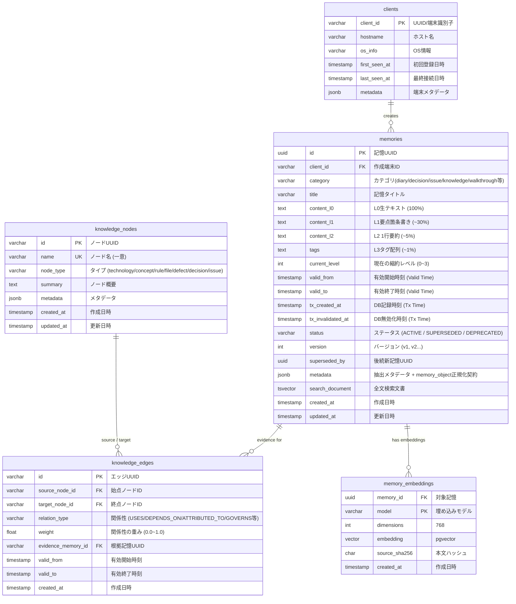

# Database ER Diagram - llm_memory

PostgreSQL 18 における `llm_memory` データベースの ER 図およびテーブル構造定義ですわ。

```mermaid
erDiagram
    clients ||--o{ memories : "creates"
    memories ||--o{ knowledge_edges : "evidence for"
    memories ||--o{ memory_embeddings : "has embeddings"
    knowledge_nodes ||--o{ knowledge_edges : "source / target"

    clients {
        varchar client_id PK "UUID/端末識別子"
        varchar hostname "ホスト名"
        varchar os_info "OS情報"
        timestamp first_seen_at "初回登録日時"
        timestamp last_seen_at "最終接続日時"
        jsonb metadata "端末メタデータ"
    }

    memories {
        uuid id PK "記憶UUID"
        varchar client_id FK "作成端末ID"
        varchar category "カテゴリ(diary/decision/issue/knowledge/walkthrough等)"
        varchar title "記憶タイトル"
        text content_l0 "L0生テキスト (100%)"
        text content_l1 "L1要点箇条書き (~30%)"
        text content_l2 "L2 1行要約 (~5%)"
        text tags "L3タグ配列 (~1%)"
        int current_level "現在の縮約レベル (0~3)"
        timestamp valid_from "有効開始時刻 (Valid Time)"
        timestamp valid_to "有効終了時刻 (Valid Time)"
        timestamp tx_created_at "DB記録時刻 (Tx Time)"
        timestamp tx_invalidated_at "DB無効化時刻 (Tx Time)"
        varchar status "ステータス (ACTIVE / SUPERSEDED / DEPRECATED)"
        int version "バージョン (v1, v2...)"
        uuid superseded_by "後続新記憶UUID"
        jsonb metadata "抽出メタデータ + memory_object正規化契約"
        tsvector search_document "全文検索文書"
        timestamp created_at "作成日時"
        timestamp updated_at "更新日時"
    }

    memory_embeddings {
        uuid memory_id FK "対象記憶"
        varchar model PK "埋め込みモデル"
        int dimensions "768"
        vector embedding "pgvector"
        char source_sha256 "本文ハッシュ"
        timestamp created_at "作成日時"
    }

    knowledge_nodes {
        varchar id PK "ノードUUID"
        varchar name UK "ノード名 (一意)"
        varchar node_type "タイプ (technology/concept/rule/file/defect/decision/issue)"
        text summary "ノード概要"
        jsonb metadata "メタデータ"
        timestamp created_at "作成日時"
        timestamp updated_at "更新日時"
    }

    knowledge_edges {
        varchar id PK "エッジUUID"
        varchar source_node_id FK "始点ノードID"
        varchar target_node_id FK "終点ノードID"
        varchar relation_type "関係性 (USES/DEPENDS_ON/ATTRIBUTED_TO/GOVERNS等)"
        float weight "関係性の重み (0.0~1.0)"
        varchar evidence_memory_id FK "根拠記憶UUID"
        timestamp valid_from "有効開始時刻"
        timestamp valid_to "有効終了時刻"
        timestamp created_at "作成日時"
    }
```
