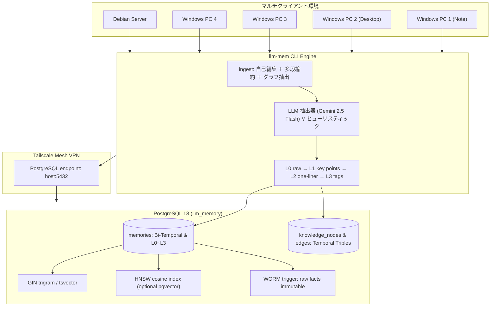

# Architecture & Memory Compaction - llm-memory

Multi-client Tailscale 接続と多段記憶縮約（L0 → L1 → L2 → L3）のアーキテクチャ図ですわ。検索はTrigram/ILIKEと全文検索を基本とし、任意でpgvectorによる意味検索を利用できます。

```mermaid
flowchart TD
    subgraph Clients["マルチクライアント環境"]
        W1["Windows PC 1 (Note)"]
        W2["Windows PC 2 (Desktop)"]
        W3["Windows PC 3"]
        W4["Windows PC 4"]
        Deb["Debian Server"]
    end

    subgraph Network["Tailscale Mesh VPN"]
        TS["PostgreSQL endpoint: host:5432"]
    end

    subgraph Engine["llm-mem CLI Engine"]
        Ingest["ingest: 自己編集 ＋ 多段縮約 ＋ グラフ抽出"]
        Extractor["LLM 抽出器 (Gemini 2.5 Flash) ∨ ヒューリスティック"]
        Compactor["L0 raw → L1 key points → L2 one-liner → L3 tags"]
    end

    subgraph PostgreSQL["PostgreSQL 18 (llm_memory)"]
        MemTable[("memories: Bi-Temporal & L0~L3")]
        GraphTable[("knowledge_nodes & edges: Temporal Triples")]
        TrgmIndex["GIN trigram / tsvector"]
        VectorIndex["HNSW cosine index (optional pgvector)"]
        WormGuard["WORM trigger: raw facts immutable"]
    end

    W1 --> Engine
    W2 --> Engine
    W3 --> Engine
    W4 --> Engine
    Deb --> Engine
    Engine --> TS
    TS --> PostgreSQL
    Ingest --> Extractor
    Extractor --> Compactor
    Compactor --> MemTable
    Compactor --> GraphTable
    MemTable --> TrgmIndex
    MemTable --> VectorIndex
    MemTable --> WormGuard
```
