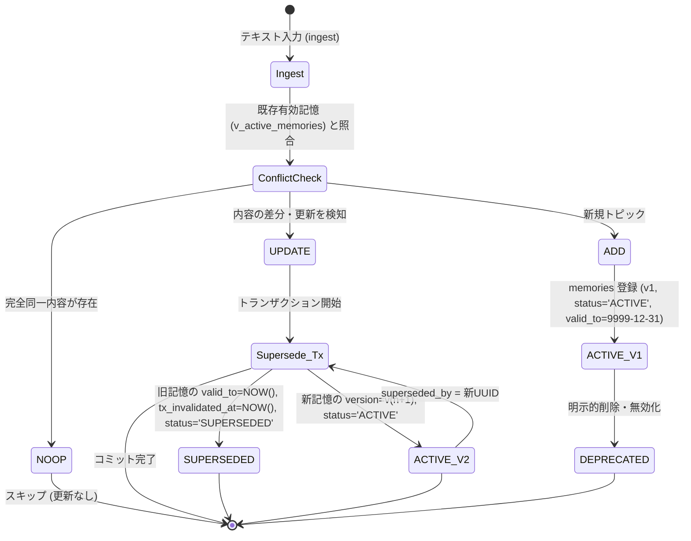

# State Diagram - Self-Editing Memory Lifecycle (JITMIND-inspired)

二重時間軸（Valid Time / Transaction Time）における記憶の自己編集ライフサイクル状態遷移図ですわ。

```mermaid
stateDiagram-v2
    [*] --> Ingest: テキスト入力 (ingest)
    
    Ingest --> ConflictCheck: 既存有効記憶 (v_active_memories) と照合
    
    ConflictCheck --> NOOP: 完全同一内容が存在
    NOOP --> [*]: スキップ (更新なし)
    
    ConflictCheck --> ADD: 新規トピック
    ADD --> ACTIVE_V1: memories 登録 (v1, status='ACTIVE', valid_to=9999-12-31)
    
    ConflictCheck --> UPDATE: 内容の差分・更新を検知
    UPDATE --> Supersede_Tx: トランザクション開始
    Supersede_Tx --> SUPERSEDED: 旧記憶の valid_to=NOW(), tx_invalidated_at=NOW(), status='SUPERSEDED'
    Supersede_Tx --> ACTIVE_V2: 新記憶の version=v(n+1), status='ACTIVE'
    ACTIVE_V2 --> Supersede_Tx: superseded_by = 新UUID
    Supersede_Tx --> [*]: コミット完了
    
    ACTIVE_V1 --> DEPRECATED: 明示的削除・無効化
    SUPERSEDED --> [*]
    ACTIVE_V2 --> [*]
    DEPRECATED --> [*]
```
